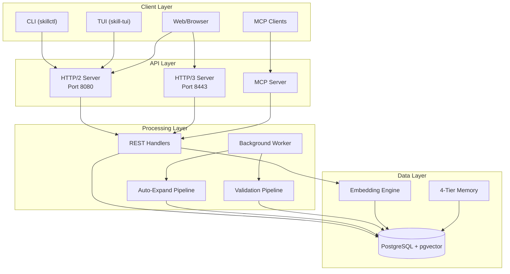

# HelixKnowledge Skill Graph System

[](https://github.com/helixdevelopment/skill-system)
[](https://golang.org)
[](LICENSE)
[](https://docker.com)
[](https://podman.io)

> **AI-powered skill tracking with auto-growth, validation, and multi-source evidence collection.**

The HelixKnowledge Skill Graph System is a production-grade Go application that tracks developer skills as an interconnected graph with automatic expansion, evidence-based validation, and semantic search powered by pgvector embeddings.

## Features

- **Skill Dependency Graph**: Track skills as nodes with `requires`, `enhances`, and `related_to` relationships
- **Auto-Growth Pipeline**: LLM-powered discovery of missing skills based on codebase analysis
- **Validation Pipeline**: Automated verification of claimed skills against actual evidence
- **Multi-Source Evidence**: Git commits, code analysis, documentation links, and manual entries
- **Semantic Search**: Vector-based skill search using pgvector embeddings
- **MCP Integration**: Full Model Context Protocol support for Claude Code, OpenCode, and Continue.dev
- **HTTP/2 + HTTP/3**: Modern transport with Brotli compression and QUIC support
- **REST API**: Complete CRUD with content negotiation (JSON/TOML)
- **Beautiful TUI**: Terminal interface for browsing and searching skills
- **Comprehensive CLI**: Management commands for all operations

## Quick Start

### Prerequisites

- **Docker** or **Podman** (Compose plugin)
- 4GB RAM, 10GB disk space
- Linux/macOS/Windows (WSL2)

### One-Command Install

```bash
curl -fsSL https://raw.githubusercontent.com/helixdevelopment/skill-system/main/scripts/install.sh | bash
```

### Docker Compose (Manual)

```bash
# Clone repository
git clone https://github.com/helixdevelopment/skill-system.git
cd skill-system

# Copy environment
cp .env.example .env

# Start the stack
docker compose up -d

# Check health
curl http://localhost:8080/health
```

### Services

| Service | Endpoint | Description |
|---------|----------|-------------|
| API Server | `http://localhost:8080` | HTTP/2 REST API |
| HTTP/3 API | `https://localhost:8443` | QUIC/UDP transport |
| PostgreSQL | `localhost:5432` | Database + pgvector |
| Prometheus | `http://localhost:9090` | Metrics (optional) |
| Grafana | `http://localhost:3000` | Dashboards (optional) |

## Architecture Overview



## API Documentation

### Health Check

```bash
curl http://localhost:8080/health
```

### List Skills

```bash
# JSON
curl http://localhost:8080/api/v1/skills

# TOML
curl -H "Accept: application/toml" http://localhost:8080/skills
```

### Create Skill

```bash
curl -X POST http://localhost:8080/api/v1/skills \
  -H "Content-Type: application/json" \
  -d '{
    "name": "Rust Concurrency",
    "description": "Async/await, channels, mutexes",
    "category": "backend",
    "parent_skill_id": "rust-language"
  }'
```

### Search Skills (Semantic)

```bash
curl "http://localhost:8080/api/v1/skills/search?q=distributed+systems"
```

### Full API Docs

See [docs/API.md](docs/API.md) for complete endpoint reference.

## MCP Integration

The system exposes tools via the Model Context Protocol for AI assistants:

```json
// .mcp.json (Claude Code)
{
  "mcpServers": {
    "skill-system": {
      "command": "docker",
      "args": ["exec", "-i", "skill-api", "/app/skillctl", "mcp", "stdio"]
    }
  }
}
```

### Available MCP Tools

| Tool | Description |
|------|-------------|
| `search_skills` | Semantic search across all skills |
| `get_skill` | Retrieve skill details with evidence |
| `add_evidence` | Add evidence to a skill |
| `validate_skill` | Trigger validation for a skill |
| `get_learning_path` | Generate learning path between skills |

See [docs/MCP_INTEGRATION.md](docs/MCP_INTEGRATION.md) for detailed configuration.

## Configuration

All configuration is via environment variables or `config.toml`:

```env
# Core
DB_PASSWORD=secure-password
JWT_SECRET=your-jwt-secret
API_KEY=service-api-key

# Features
ENABLE_AUTO_EXPAND=true
AUTO_EXPAND_MAX_DEPTH=3
EMBEDDING_DIMENSION=768

# LLM (for auto-expansion)
LLM_PROVIDER=openai
LLM_API_KEY=sk-...
LLM_MODEL=gpt-4
```

See `.env.example` for all options.

## Development Setup

```bash
# Install dependencies
make tidy

# Run tests
make test

# Start dev stack
make dev

# Run server
make run

# Run worker
make run-worker

# Run linter
make lint
```

### Project Structure

```
.
├── cmd/
│   ├── server/        # HTTP/2 + HTTP/3 API server
│   ├── worker/        # Background processing
│   ├── cli/           # Command-line interface
│   └── tui/           # Terminal UI
├── internal/
│   ├── api/           # REST handlers & middleware
│   ├── autoexpand/    # Skill auto-expansion engine
│   ├── codeanalysis/  # Codebase analysis
│   ├── config/        # Configuration management
│   ├── db/            # Database layer & queries
│   ├── mcp/           # MCP server implementation
│   ├── models/        # Data models
│   ├── registry/      # Skill registry
│   ├── skill/         # Skill CRUD operations
│   ├── validation/    # Evidence validation
│   └── worker/        # Task queue & processing
├── migrations/        # SQL migrations
├── scripts/           # Lifecycle scripts
├── docs/              # Documentation
├── config/            # Configuration templates
├── Dockerfile         # Multi-stage build
├── docker-compose.yml # Full stack
├── Makefile           # Build automation
└── README.md          # This file
```

## Memory Architecture

The system implements a 4-tier memory system inspired by cognitive architectures:

| Tier | Scope | TTL | Purpose |
|------|-------|-----|---------|
| Working | Request | 1 hour | Active session context |
| Episodic | User | 30 days | Historical events |
| Semantic | Global | Persistent | Skill embeddings & relationships |
| Procedural | System | Persistent | Execution patterns & learned rules |

## Contributing

1. Fork the repository
2. Create a feature branch (`git checkout -b feature/amazing-feature`)
3. Make your changes
4. Run tests (`make test`)
5. Commit with clear messages
6. Push and open a Pull Request

See [docs/ARCHITECTURE.md](docs/ARCHITECTURE.md) for system design details.

## License

[MIT](LICENSE) - HelixDevelopment Team

## Support

- **Issues**: [GitHub Issues](https://github.com/helixdevelopment/skill-system/issues)
- **Discussions**: [GitHub Discussions](https://github.com/helixdevelopment/skill-system/discussions)
- **Documentation**: [docs/](docs/)
