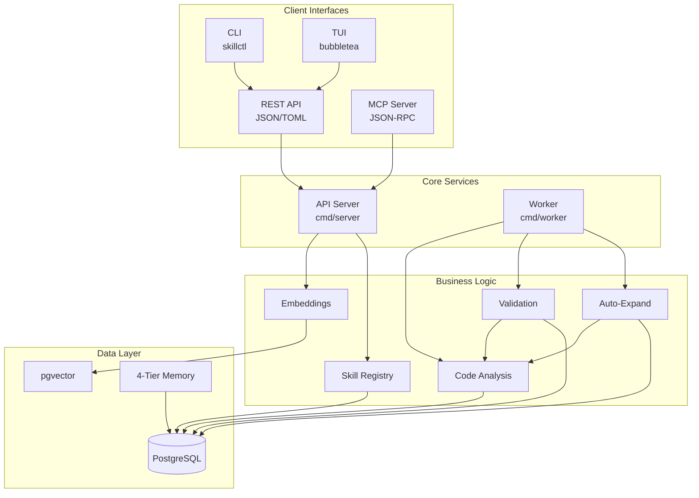
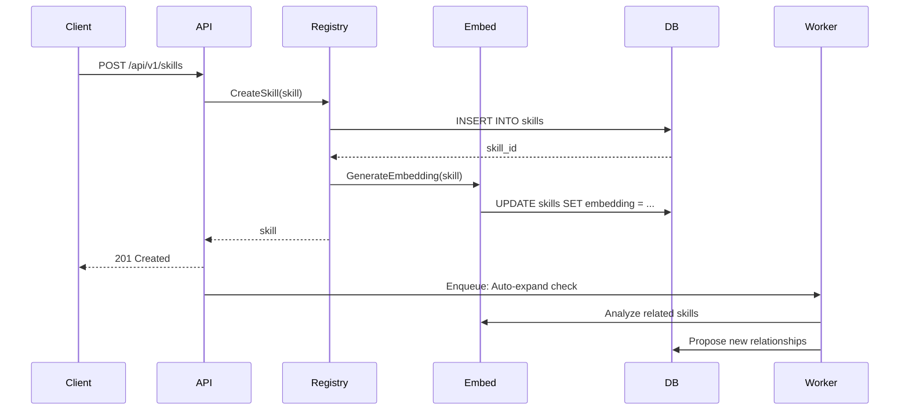
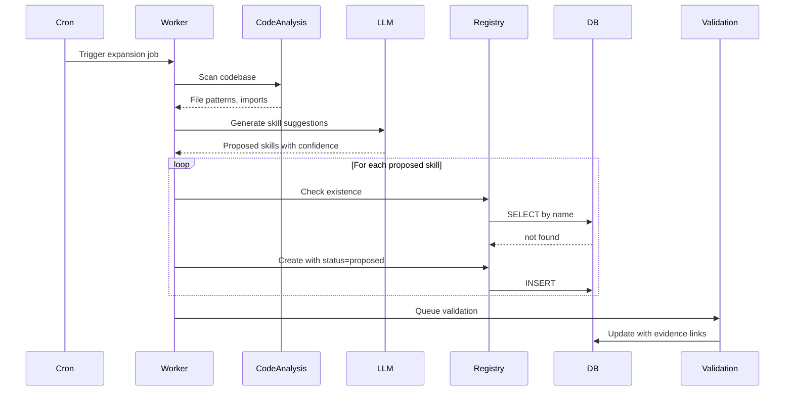
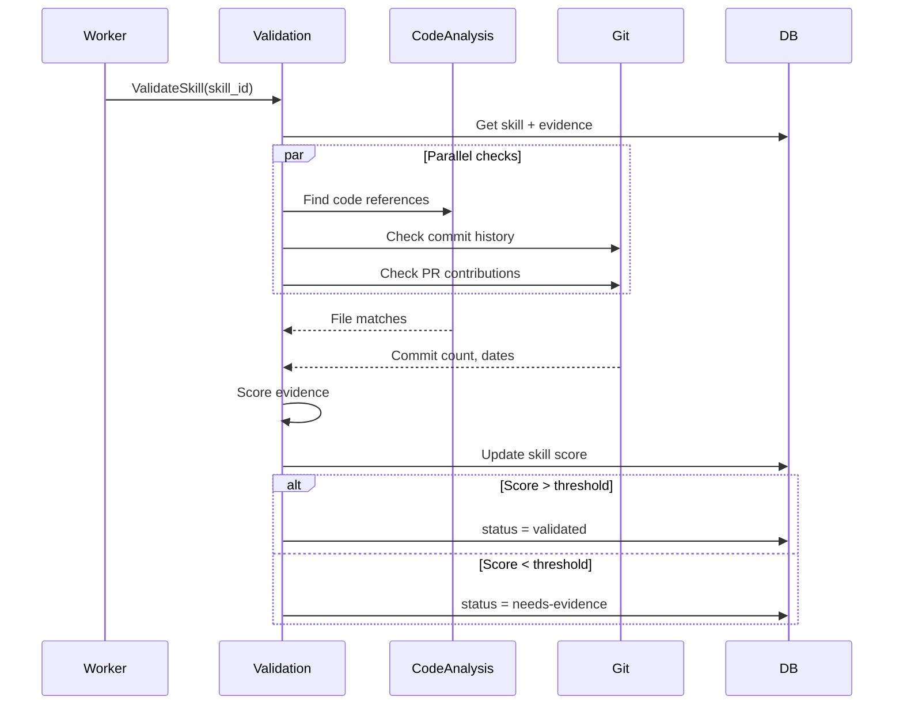
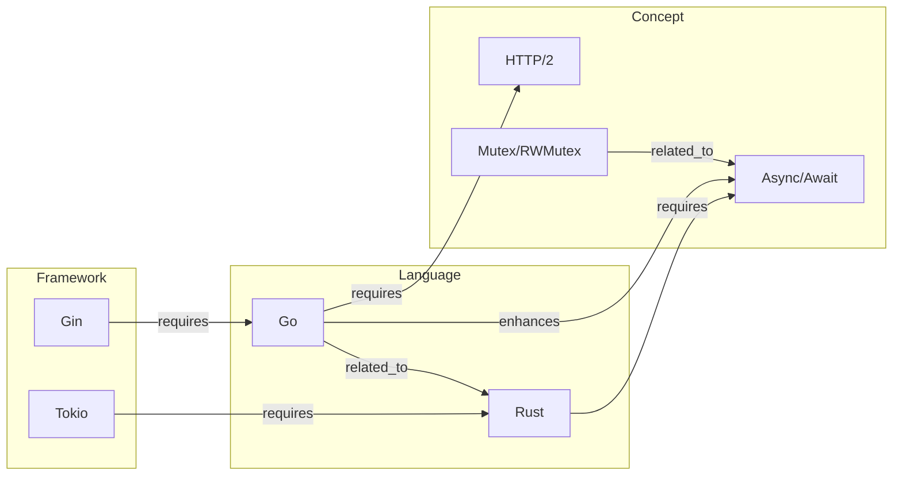
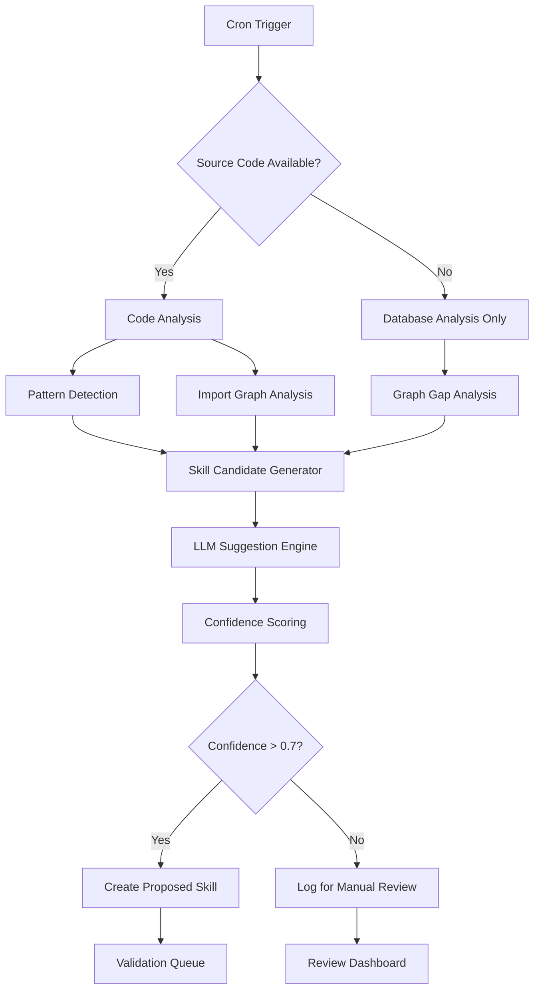
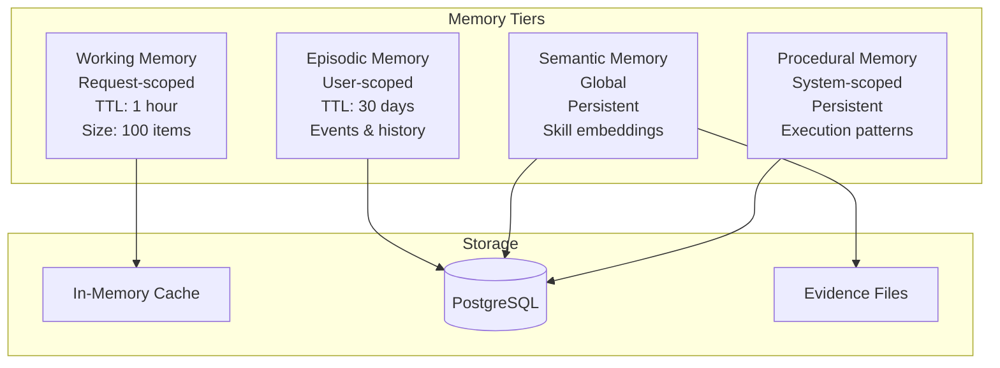
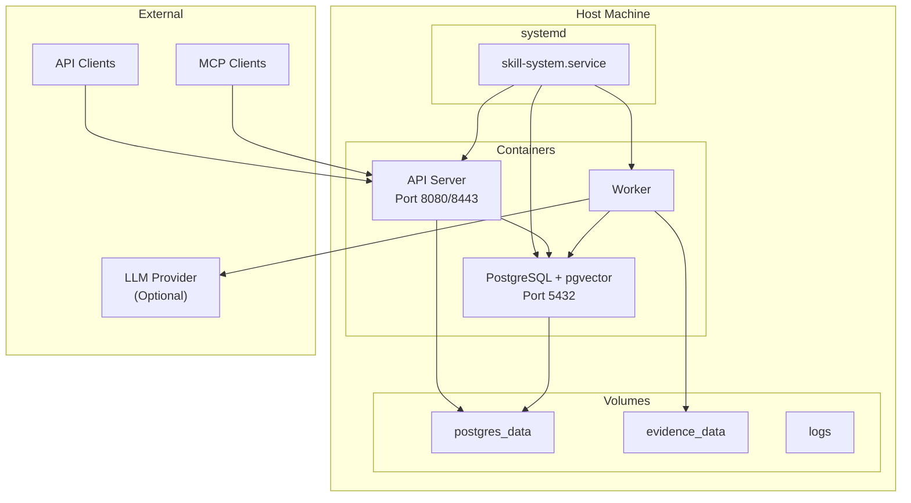

# Architecture Documentation

## Table of Contents

- [System Overview](#system-overview)
- [Component Architecture](#component-architecture)
- [Data Flow](#data-flow)
- [Skill Dependency Graph](#skill-dependency-graph)
- [Auto-Growth Pipeline](#auto-growth-pipeline)
- [Validation Pipeline](#validation-pipeline)
- [Memory Architecture](#memory-architecture)
- [Integration Points](#integration-points)
- [Database Schema](#database-schema)
- [Deployment Architecture](#deployment-architecture)

---

## System Overview

The HelixKnowledge Skill Graph System is a Go-based microservices application designed to track, validate, and automatically expand developer skill graphs. It combines traditional relational storage (PostgreSQL) with vector search (pgvector) and LLM-powered analysis to create a self-improving knowledge representation.

### Key Design Principles

1. **Evidence-Based**: Every skill claim must be backed by evidence
2. **Auto-Growing**: The graph expands automatically based on code analysis
3. **Validated**: A continuous validation pipeline checks skill accuracy
4. **Semantic Search**: Vector embeddings enable meaning-based skill discovery
5. **Memory-Aware**: 4-tier memory system mimics human cognition

---

## Component Architecture



### Component Descriptions

| Component | Package | Responsibility |
|-----------|---------|----------------|
| API Server | `cmd/server` | HTTP/2 + HTTP/3 endpoints, request handling |
| Worker | `cmd/worker` | Background jobs, auto-expansion, validation |
| CLI | `cmd/cli` | Management commands via Cobra |
| TUI | `cmd/tui` | Interactive terminal interface |
| Skill Registry | `internal/registry` | CRUD operations, graph traversal |
| Auto-Expand | `internal/autoexpand` | LLM-powered skill discovery |
| Validation | `internal/validation` | Evidence verification |
| Code Analysis | `internal/codeanalysis` | AST parsing, tree-sitter integration |
| Embeddings | `internal/models` | Vector generation, similarity search |
| MCP Server | `internal/mcp` | Model Context Protocol implementation |
| Database | `internal/db` | Query layer, connection pooling |
| Config | `internal/config` | TOML-based configuration |

---

## Data Flow

### Skill Creation Flow



### Auto-Expansion Flow



### Validation Flow



---

## Skill Dependency Graph

### Graph Structure

Skills form a directed graph with typed edges:



### Relationship Types

| Type | Direction | Meaning |
|------|-----------|---------|
| `requires` | A -> B | Learning A requires knowing B first |
| `enhances` | A -> B | A builds upon/enhances B |
| `related_to` | A <-> B | A and B are conceptually related |

### Graph Properties

- **Acyclic by constraint** (no circular `requires` edges)
- **Weighted edges** (strength 0.0-1.0)
- **Multi-parent**: A skill can require multiple prerequisites
- **Confidence scoring**: Each edge has a confidence score from validation

---

## Auto-Growth Pipeline

### Overview

The auto-growth pipeline discovers new skills by analyzing:

1. **Code patterns** in the codebase
2. **Import graphs** showing library dependencies
3. **LLM reasoning** about gaps in the skill graph

### Pipeline Stages



### Bounding Parameters

| Parameter | Default | Description |
|-----------|---------|-------------|
| `AUTO_EXPAND_MAX_DEPTH` | 3 | Max graph depth for expansion |
| `AUTO_EXPAND_CONFIDENCE_THRESHOLD` | 0.7 | Minimum confidence for auto-creation |
| `AUTO_EXPAND_COOLDOWN` | 24h | Minimum time between expansions |
| `AUTO_EXPAND_MAX_CANDIDATES` | 10 | Max candidates per run |

### Hallucination Prevention

1. **Code existence check**: Proposed skills must match actual code patterns
2. **Duplicate detection**: Fuzzy matching against existing skills
3. **Human review gate**: Proposed skills start with `status=proposed`
4. **Confidence scoring**: Multi-factor scoring (code match, LLM confidence, graph relevance)

---

## Validation Pipeline

### Overview

The validation pipeline continuously verifies that claimed skills are backed by actual evidence.

### Evidence Sources

| Source | Weight | Auto-Detect |
|--------|--------|-------------|
| Git commits | 0.3 | Yes |
| Code files | 0.4 | Yes |
| Pull requests | 0.2 | Yes |
| Documentation | 0.1 | No |
| Manual entry | 0.0 | N/A (baseline) |

### Validation Score

```
score = sum(evidence_weight * evidence_strength) / max_possible
```

- **score >= 0.8**: `validated` - Strong evidence
- **0.5 <= score < 0.8**: `partial` - Some evidence
- **score < 0.5**: `needs-evidence` - Insufficient evidence

### Validation Schedule

- **Full validation**: Every 24 hours (configurable)
- **Incremental**: On new evidence addition
- **On-demand**: Via API call `/api/v1/skills/{id}/validate`

---

## Memory Architecture

The system implements a 4-tier memory system inspired by human cognitive architecture:



### Working Memory

- **Scope**: Per-request or per-session
- **TTL**: 1 hour
- **Size**: 100 items (LRU eviction)
- **Content**: Active skills being viewed, search context
- **Storage**: In-memory with sync to Redis

### Episodic Memory

- **Scope**: Per-user
- **TTL**: 30 days
- **Content**: Historical events (skill views, searches, additions)
- **Use**: Personalization, "recently viewed", learning recommendations
- **Storage**: PostgreSQL with time-series indexing

### Semantic Memory

- **Scope**: Global
- **TTL**: Persistent
- **Content**: Skill embeddings, relationship vectors, normalized skill data
- **Use**: Semantic search, similarity matching, graph traversal
- **Storage**: pgvector in PostgreSQL

### Procedural Memory

- **Scope**: System-wide
- **TTL**: Persistent
- **Content**: Learned execution patterns, validation rules, expansion heuristics
- **Use**: Auto-tuning, smart defaults, pattern-based suggestions
- **Storage**: PostgreSQL with JSONB flexibility

---

## Integration Points

### REST API

Full CRUD with content negotiation:

```
GET    /api/v1/skills          # List (JSON/TOML)
POST   /api/v1/skills          # Create
GET    /api/v1/skills/:id      # Read
PUT    /api/v1/skills/:id      # Update
DELETE /api/v1/skills/:id      # Delete
GET    /api/v1/skills/search   # Semantic search
POST   /api/v1/skills/:id/evidence  # Add evidence
POST   /api/v1/skills/:id/validate  # Trigger validation
GET    /api/v1/graph           # Graph export
GET    /health                 # Health check (open; served at root, NOT under /api/v1)
GET    /metrics                # Prometheus metrics (served at root)
```

### MCP (Model Context Protocol)

JSON-RPC 2.0 over stdio or Server-Sent Events:

| Tool | Input | Output |
|------|-------|--------|
| `search_skills` | `query`, `limit` | Matching skills with scores |
| `get_skill` | `skill_id` | Full skill details + evidence |
| `add_evidence` | `skill_id`, `type`, `url` | Evidence record |
| `validate_skill` | `skill_id` | Validation result |
| `get_learning_path` | `from`, `to` | Ordered skill path |

### CLI Commands

```bash
skillctl skill list              # List all skills
skillctl skill get <id>          # Get skill details
skillctl skill create --file ... # Create from file
skillctl search "async rust"     # Semantic search
skillctl expand                  # Trigger auto-expansion
skillctl validate                # Run validation
skillctl backup                  # Create backup
skillctl restore <file>          # Restore from backup
skillctl mcp stdio               # Start MCP server
```

### TUI Navigation

```
+------------------------------------------+
|  Skill Graph System          [Search...] |
+------------------------------------------+
|  Categories                              |
|  [All] [Languages] [Frameworks] [Tools]  |
+------------------------------------------+
|  Skills                    Evidence      |
|  > Go                       5 entries    |
|    > Concurrency            3 entries    |
|    > Generics               1 entry      |
|  > Rust                                  |
|    > Ownership                           |
|    > Lifetimes                           |
+------------------------------------------+
|  Status: Connected | 47 skills | v1.0.0 |
+------------------------------------------+
```

---

## Database Schema

### Core Tables

```sql
-- Skills (main entity)
CREATE TABLE skills (
    id              UUID PRIMARY KEY DEFAULT gen_random_uuid(),
    name            TEXT NOT NULL UNIQUE,
    description     TEXT,
    category        TEXT NOT NULL,
    parent_skill_id UUID REFERENCES skills(id),
    status          TEXT DEFAULT 'proposed', -- proposed, validated, deprecated
    confidence      FLOAT DEFAULT 0.0,
    embedding       vector(768),
    metadata        JSONB DEFAULT '{}',
    created_at      TIMESTAMP DEFAULT CURRENT_TIMESTAMP,
    updated_at      TIMESTAMP DEFAULT CURRENT_TIMESTAMP
);

-- Skill relationships (graph edges)
CREATE TABLE skill_relationships (
    id              UUID PRIMARY KEY DEFAULT gen_random_uuid(),
    source_skill_id UUID NOT NULL REFERENCES skills(id) ON DELETE CASCADE,
    target_skill_id UUID NOT NULL REFERENCES skills(id) ON DELETE CASCADE,
    relationship_type TEXT NOT NULL, -- requires, enhances, related_to
    strength        FLOAT DEFAULT 0.5,
    confidence      FLOAT DEFAULT 0.0,
    created_at      TIMESTAMP DEFAULT CURRENT_TIMESTAMP,
    UNIQUE(source_skill_id, target_skill_id, relationship_type)
);

-- Evidence
CREATE TABLE evidence (
    id              UUID PRIMARY KEY DEFAULT gen_random_uuid(),
    skill_id        UUID NOT NULL REFERENCES skills(id) ON DELETE CASCADE,
    evidence_type   TEXT NOT NULL, -- git_commit, code_file, pr, documentation, manual
    source_url      TEXT,
    description     TEXT,
    strength        FLOAT DEFAULT 0.5,
    metadata        JSONB DEFAULT '{}',
    created_at      TIMESTAMP DEFAULT CURRENT_TIMESTAMP
);

-- Validation history
CREATE TABLE validation_history (
    id              UUID PRIMARY KEY DEFAULT gen_random_uuid(),
    skill_id        UUID NOT NULL REFERENCES skills(id) ON DELETE CASCADE,
    score           FLOAT NOT NULL,
    status          TEXT NOT NULL,
    details         JSONB DEFAULT '{}',
    validated_at    TIMESTAMP DEFAULT CURRENT_TIMESTAMP
);

-- Schema migrations tracking
CREATE TABLE schema_migrations (
    version         BIGINT PRIMARY KEY,
    applied_at      TIMESTAMP DEFAULT CURRENT_TIMESTAMP,
    description     TEXT
);
```

### Indexes

```sql
CREATE INDEX idx_skills_category ON skills(category);
CREATE INDEX idx_skills_status ON skills(status);
CREATE INDEX idx_skills_embedding ON skills USING ivfflat (embedding vector_cosine_ops);
CREATE INDEX idx_relationships_source ON skill_relationships(source_skill_id);
CREATE INDEX idx_relationships_target ON skill_relationships(target_skill_id);
CREATE INDEX idx_evidence_skill ON evidence(skill_id);
CREATE INDEX idx_evidence_type ON evidence(evidence_type);
CREATE INDEX idx_validation_skill ON validation_history(skill_id);
```

---

## Deployment Architecture

### Production Stack



### Resource Requirements

| Component | CPU | Memory | Storage |
|-----------|-----|--------|---------|
| API Server | 1 core | 512MB | Minimal |
| Worker | 2 cores | 1GB | Minimal |
| PostgreSQL | 1 core | 1GB | 10GB+ |
| **Total** | **4 cores** | **4GB** | **10GB** |

### Network

| Port | Protocol | Purpose |
|------|----------|---------|
| 8080 | TCP | HTTP/2 API |
| 8443 | UDP | HTTP/3 (QUIC) |
| 5432 | TCP | PostgreSQL |
| 9090 | TCP | Prometheus (optional) |
| 3000 | TCP | Grafana (optional) |
